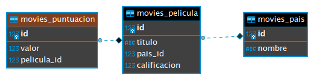

# django_movies

## Modelo de datos

## Como ejecutar

### Heroku
El API está desplegado en Heroku, todos los endpoints pueden ser accedidos a través de la URL: https://juancsr-djangomovies.herokuapp.com/movies/v1/

### Virtualenv
La aplicación se desarrollo utilizando un entorno virtual utilizando [pyenv](https://github.com/pyenv/pyenv) con una versión de python 3.7.7.

*Instalar dependencias*
`pip install -r requirements.txt`

### Docker 
Simplemente levantando los dos contenedores con el comando `docker-compose up` es posible tener la aplicación ejecutándose junto con una BD de postgres 12.ç

Ejecutándo el script `run_docker.sh` se crearan automáticamente las variables de entorno para el API y el contenedor de postgres.
